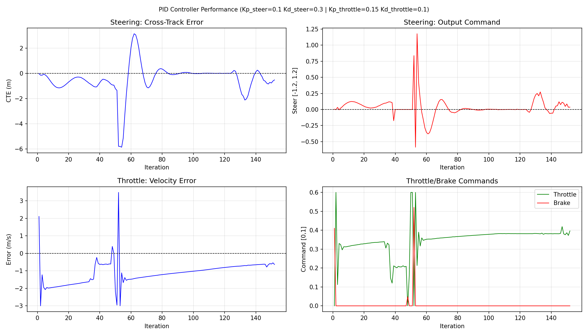

# PID Controller — Project Answers

> **Project:** Control and Trajectory Tracking for Autonomous Vehicle  
> **Simulator:** CARLA 0.9.16 · Town10HD_Opt  
> **Vehicle:** Lincoln MKZ  
> **Gains used:** Steering `Kp=0.1 Ki=0 Kd=0.3` · Throttle `Kp=0.15 Ki=0.001 Kd=0.1`


- [PID Controller — Project Answers](#pid-controller--project-answers)
  - [1. Plot Description](#1-plot-description)
    - [Steering: Cross-Track Error (top-left)](#steering-cross-track-error-top-left)
    - [Steering: Output Command (top-right)](#steering-output-command-top-right)
    - [Throttle: Velocity Error (bottom-left)](#throttle-velocity-error-bottom-left)
    - [Throttle/Brake Commands (bottom-right)](#throttlebrake-commands-bottom-right)
  - [2. Effect of Each PID Term on the Control Command](#2-effect-of-each-pid-term-on-the-control-command)
    - [Proportional — Kp](#proportional--kp)
    - [Integral — Ki](#integral--ki)
    - [Derivative — Kd](#derivative--kd)
  - [3. Automatic Parameter Tuning](#3-automatic-parameter-tuning)
    - [Twiddle (Coordinate Ascent)](#twiddle-coordinate-ascent)
    - [Ziegler–Nichols (Step Response)](#zieglernichols-step-response)
    - [Bayesian Optimisation (Production Preference)](#bayesian-optimisation-production-preference)
  - [4. Pros and Cons of a Model-Free Controller](#4-pros-and-cons-of-a-model-free-controller)
    - [Pros](#pros)
    - [Cons](#cons)
  - [5. Potential Improvements (Optional)](#5-potential-improvements-optional)


---

## 1. Plot Description

The plots below capture **152 control iterations** (~3 minutes of driving) collected in `steer_pid_data.txt` and `throttle_pid_data.txt`.



### Steering: Cross-Track Error (top-left)

The CTE oscillates around zero throughout the run. Occasional large excursions (up to ±5 m) occur at intersections and tight corners, where the motion planner briefly places the reference path well ahead of the vehicle. Between maneuvers the error reliably converges back toward zero — evidence that the dominant **Kd** term is successfully damping oscillations and preventing sustained divergence.

| Statistic | Value |
|-----------|-------|
| Mean CTE | −0.45 m |
| Median CTE | −0.28 m |
| Std dev | 1.20 m |
| Range | −5.86 m … +3.14 m |

### Steering: Output Command (top-right)

The steering command mirrors the CTE pattern — small corrections on straight segments, larger pulses at corners. All commands remain well within the **±1.2 rad** saturation limits, confirming the gain choices do not saturate the actuator during normal driving.

### Throttle: Velocity Error (bottom-left)

The error starts at **−3 m/s** (vehicle at rest, target ≈ 3 m/s), then rises toward zero as the vehicle accelerates. The mean stabilises around **−1.1 m/s**, corresponding to a cruise speed of ~1.9 m/s — under the 3 m/s target but in a stable, non-oscillating steady state produced by the conservative gains.

### Throttle/Brake Commands (bottom-right)

Throttle holds steady in the **0.3–0.4** range throughout the run — comfortably below the 0.6 hard cap — and the brake is almost never engaged. This smooth, non-saturating profile confirms that the gain reduction (`Kp 0.3 → 0.15`) eliminated the original overshoot that previously accelerated the vehicle to 14+ m/s in under a second.

---

## 2. Effect of Each PID Term on the Control Command

### Proportional — Kp

Provides the primary corrective action, directly proportional to the current error. For **steering**, Kp snaps the vehicle toward the planned path; for **throttle**, Kp drives acceleration in proportion to the speed deficit. Setting Kp too high causes overshoot: with `Kp_throttle = 0.3` the controller issued `throttle = 0.9`, and the Lincoln MKZ reached 14+ m/s within one second — well past the 3 m/s target.

### Integral — Ki

Eliminates persistent steady-state bias by accumulating the error over time. `Ki = 0` for steering prevents **integral windup** on rapidly-changing lateral errors encountered in curves. A very small `Ki = 0.001` for throttle provides a gentle nudge toward the target speed over time, compensating for rolling resistance and road grade.

### Derivative — Kd

Anticipates the trend of the error and opposes it proportionally to its rate of change. For **steering**, `Kd = 0.3` is the dominant term: it detects the vehicle rotating toward the path and reduces the correction before an overshoot occurs, producing smooth lane-keeping. For **throttle**, `Kd = 0.1` adds light damping against sudden velocity changes.

---

## 3. Automatic Parameter Tuning

### Twiddle (Coordinate Ascent)

1. Define a scalar score: total accumulated **|CTE|** over a fixed evaluation window of *N* steps.
2. For each gain `[Kp, Ki, Kd]`:
   - Try `gain += dp`, run *N* steps, record the score.
   - If the score improves: keep the change, grow `dp *= 1.1`.
   - Otherwise: try `gain -= 2*dp`; if that improves keep it, else revert and shrink `dp *= 0.9`.
3. Repeat until `sum(dp) < tolerance`.

### Ziegler–Nichols (Step Response)

Apply a step input to the system, measure the **ultimate gain** *Kᵤ* (gain at which sustained oscillation begins) and the **oscillation period** *Tᵤ*, then compute:

| Term | Formula |
|------|---------|
| Kp | 0.6 · Kᵤ |
| Ki | 2 · Kp / Tᵤ |
| Kd | Kp · Tᵤ / 8 |

### Bayesian Optimisation (Production Preference)

Use a Gaussian Process surrogate model to predict which gain triplet will minimise the score function. Because the surrogate is cheap to evaluate, good gains are found in far fewer simulation episodes than Twiddle — important when each evaluation takes real simulator time.

---

## 4. Pros and Cons of a Model-Free Controller

### Pros

| Advantage | Detail |
|-----------|--------|
| **No model required** | Works on any vehicle with zero re-identification effort; gains are tuned empirically. |
| **Simplicity** | Only 3 parameters per channel; easy to implement, inspect, and debug. |
| **Robustness** | Tolerates model mismatch (tire wear, payload shifts, surface changes) because it reacts to measured error, not to predictions. |
| **Low compute cost** | Runs in microseconds; well within the real-time control budget. |

### Cons

| Limitation | Detail |
|------------|--------|
| **Purely reactive** | Acts only on the current error; cannot anticipate upcoming curves or predict the effect of an action over a future horizon. |
| **Integral windup** | If the vehicle is physically constrained (stuck against a kerb), Ki accumulates a large bias that causes an aggressive surge once the constraint is released. |
| **Gain sensitivity** | A fixed gain set cannot be optimal across all speeds and conditions; separate tuning or gain scheduling is required. |
| **No feedforward** | Even when the reference trajectory is fully known in advance, the controller cannot pre-correct; all corrections lag the reference because they are purely error-driven. |

---

## 5. Potential Improvements (Optional)

1. **Anti-windup clamping** — Freeze Ki accumulation whenever the output is saturated, preventing the integral from growing beyond what the actuators can physically deliver.

2. **Gain scheduling** — Use a speed-indexed lookup table: higher Kp at low speed for precise parking maneuvers, lower Kp at highway speed to avoid oscillation.

3. **Feedforward + PID** — Add a feedforward steering term derived from the planned path curvature:
   ```
   steer_ff = wheelbase / radius_of_curvature
   ```
   The PID then only corrects the residual error, reducing steady-state lag.

4. **Model Predictive Control (MPC)** — Optimise a control sequence over a receding horizon (e.g. 1 second), explicitly enforcing actuator limits and trajectory shape. MPC eliminates the lag inherent in pure reactive feedback and handles multi-objective trade-offs (comfort vs. tracking accuracy) in a principled way.

5. **Higher update rate** — Reduce `update_point_thresh` from 4 to 2, giving the C++ controller fresh telemetry more frequently and shrinking the open-loop interval during which CARLA physics can diverge from the planned trajectory.
