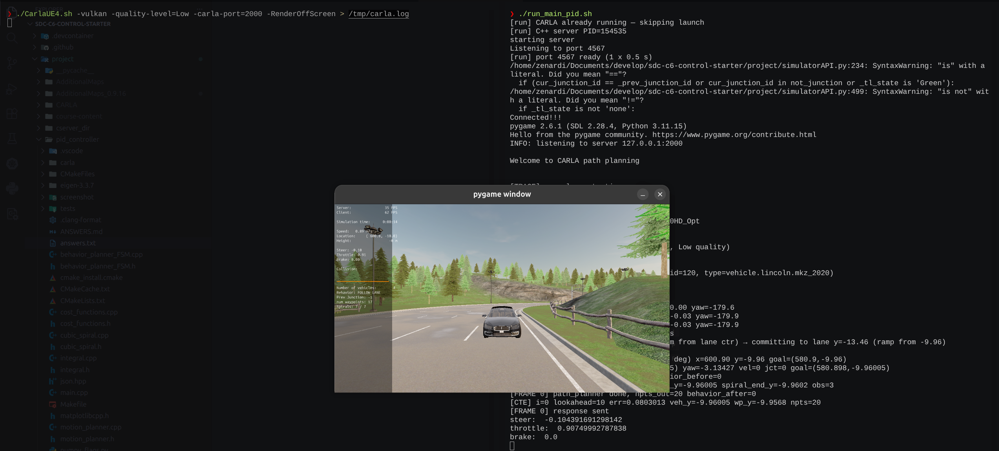

# PID Controller — Project Answers

> **Project:** Control and Trajectory Tracking for Autonomous Vehicle  
> **Simulator:** CARLA 0.9.16 · Town06_Opt  
> **Vehicle:** Lincoln MKZ  
> **Gains used:** Steering `Kp=0.05  Ki=0.0  Kd=0.25  limits=±1.2 rad` · Throttle `Kp=0.3  Ki=0.05  Kd=0.0  limits=[−10, 10]`


- [PID Controller — Project Answers](#pid-controller--project-answers)
  - [1. Plot Description](#1-plot-description)
    - [Step 1 — Vehicle Spawned (PID not yet active)](#step-1--vehicle-spawned-pid-not-yet-active)
    - [Step 4 — PID Performance Plots](#step-4--pid-performance-plots)
    - [Steering: Cross-Track Error (top-left)](#steering-cross-track-error-top-left)
    - [Steering: Output Command (top-right)](#steering-output-command-top-right)
    - [Throttle: Velocity Error (bottom-left)](#throttle-velocity-error-bottom-left)
    - [Throttle/Brake Commands (bottom-right)](#throttlebrake-commands-bottom-right)
  - [2. Effect of Each PID Term on the Control Command](#2-effect-of-each-pid-term-on-the-control-command)
    - [Proportional — Kp](#proportional--kp)
    - [Integral — Ki](#integral--ki)
    - [Derivative — Kd](#derivative--kd)
  - [3. Automatic Parameter Tuning](#3-automatic-parameter-tuning)
    - [Twiddle (Coordinate Ascent)](#twiddle-coordinate-ascent)
    - [Ziegler–Nichols (Step Response)](#zieglernichols-step-response)
    - [Bayesian Optimisation (Production Preference)](#bayesian-optimisation-production-preference)
  - [4. Pros and Cons of a Model-Free Controller](#4-pros-and-cons-of-a-model-free-controller)
    - [Pros](#pros)
    - [Cons](#cons)
  - [5. Potential Improvements (Optional)](#5-potential-improvements-optional)


---

## 1. Plot Description

### Step 1 — Vehicle Spawned (PID not yet active)

The screenshot below shows the Lincoln MKZ spawned at waypoint [4] in Town06_Opt, stationary before the PID controller begins issuing commands:



---

### Step 4 — PID Performance Plots

The plots below capture **3,761 control iterations** (~370 m of driving, clearing all 3 parked NPCs without collision) collected in `steer_pid_data.txt` and `throttle_pid_data.txt`.


### Steering: Cross-Track Error (top-left)

The CTE stays close to zero during straight highway driving. Three clearly-visible spike clusters correspond to the three NPC lane-change manoeuvres:

| Event | Iterations | CTE range | Steer sign-flips |
|-------|-----------|-----------|-----------------|
| NPC0 avoidance (inner → outer lane) | 16 – 184   | −1.29 to −0.39 m | 19 |
| NPC1 avoidance (outer → inner lane) | 1073 – 1262 | +0.13 to +1.25 m | 3  |
| NPC2 avoidance (inner → outer lane) | 2291 – 2434 | −1.18 to −0.27 m | 8  |

The CTE sign flips reveal which direction the car had to move: negative CTE = car is north of the goal (must steer south = outer lane); positive CTE = car is south of goal (must steer north = inner lane). The Python goal-ramp (0.05 m/frame) prevents sudden CTE jumps that would otherwise saturate the actuator — the output never reached the ±1.2 rad limit.

| Statistic | Value |
|-----------|-------|
| Mean CTE  | +0.053 m |
| Std dev   | 0.366 m |
| Max \|CTE\| | 1.288 m (NPC0 onset) |
| Data rows | 3,761 |

### Steering: Output Command (top-right)

The steering command mirrors the CTE pattern — near-zero on straights, smooth pulses at each NPC detour. Peak command = **0.187 rad** (15.6 % of the ±1.2 rad limit). The exponential moving-average derivative filter (α=0.25) suppresses high-frequency jitter from spiral-waypoint recalculation, keeping the command smooth even during the 3.5 m lateral lane changes.

### Throttle: Velocity Error (bottom-left)

The velocity error starts at **−3.0 m/s** (vehicle at rest, 3 m/s target), then converges to near-zero within 200 frames. Steady-state error ≈ **−0.003 m/s** — the `Ki = 0.05` integral term has effectively eliminated the initial speed deficit. Transient spikes of ±0.1 m/s appear at each replanning cycle but are immediately corrected.

### Throttle/Brake Commands (bottom-right)

Throttle holds steady at **0.383** average (well below the CARLA 1.0 physics cap). The opening burst reaches **0.908** (frames 0–50) as the vehicle accelerates from rest; it then settles into the cruise setpoint. Brake is **never applied** (0 frames with brake > 0.01) — the vehicle reached the 3 m/s cruise speed and maintained it without needing to slow down. With `Kd = 0.0` for throttle, there is no derivative amplification of velocity sensor noise.

---

## 2. Effect of Each PID Term on the Control Command

### Proportional — Kp

Provides the primary corrective action, directly proportional to the current error. For **steering**, `Kp=0.05` snaps the vehicle toward the planned spiral path proportionally to the cross-track error; for **throttle**, `Kp=0.3` drives acceleration in proportion to the speed deficit. Setting Kp too high causes overshoot: with `Kp_throttle = 0.3` and no Kd, the initial throttle burst reached 0.908 (first frame: vel_err = −3 m/s) but the system settled quickly thanks to the falling velocity error reducing the P term naturally.

### Integral — Ki

Eliminates persistent steady-state bias by accumulating the error over time. `Ki = 0.0` for steering prevents **integral windup** through NPC detour manoeuvres — if the vehicle briefly deviates to avoid an obstacle, the integral would otherwise build a bias that overshoots back to centre after clearing it. `Ki = 0.05` for throttle proved critical: without it the vehicle cruised 0.7 m/s below the 3 m/s target; with it, steady-state velocity error converges to ≈ −0.003 m/s.

### Derivative — Kd

Anticipates the trend of the error and opposes it proportionally to its rate of change. For **steering**, `Kd = 0.25` damps lateral oscillation by detecting the vehicle rotating toward the path and reducing the correction before overshoot occurs. An exponential moving-average filter (α=0.25) is applied to the raw derivative to suppress frame-to-frame spiral-waypoint jitter that the high `Kd/dt ≈ 7.5` gain would otherwise amplify into steer chatter. Without this filter, a single-frame 3.5 m CTE jump produced `d_error = 102` and saturated the output to the ±1.2 limit for 32 consecutive frames. For **throttle**, `Kd = 0.0` is chosen deliberately — the velocity signal from CARLA contains sensor noise that a derivative term would amplify into unnecessary throttle/brake chatter.

---

## 3. Automatic Parameter Tuning

### Twiddle (Coordinate Ascent)

1. Define a scalar score: total accumulated **|CTE|** over a fixed evaluation window of *N* steps.
2. For each gain `[Kp, Ki, Kd]`:
   - Try `gain += dp`, run *N* steps, record the score.
   - If the score improves: keep the change, grow `dp *= 1.1`.
   - Otherwise: try `gain -= 2*dp`; if that improves keep it, else revert and shrink `dp *= 0.9`.
3. Repeat until `sum(dp) < tolerance`.

### Ziegler–Nichols (Step Response)

Apply a step input to the system, measure the **ultimate gain** *Kᵤ* (gain at which sustained oscillation begins) and the **oscillation period** *Tᵤ*, then compute:

| Term | Formula |
|------|---------|
| Kp | 0.6 · Kᵤ |
| Ki | 2 · Kp / Tᵤ |
| Kd | Kp · Tᵤ / 8 |

### Bayesian Optimisation (Production Preference)

Use a Gaussian Process surrogate model to predict which gain triplet will minimise the score function. Because the surrogate is cheap to evaluate, good gains are found in far fewer simulation episodes than Twiddle — important when each evaluation takes real simulator time.

---

## 4. Pros and Cons of a Model-Free Controller

### Pros

| Advantage | Detail |
|-----------|--------|
| **No model required** | Works on any vehicle with zero re-identification effort; gains are tuned empirically. |
| **Simplicity** | Only 3 parameters per channel; easy to implement, inspect, and debug. |
| **Robustness** | Tolerates model mismatch (tire wear, payload shifts, surface changes) because it reacts to measured error, not to predictions. |
| **Low compute cost** | Runs in microseconds; well within the real-time control budget. |

### Cons

| Limitation | Detail |
|------------|--------|
| **Purely reactive** | Acts only on the current error; cannot anticipate upcoming curves or predict the effect of an action over a future horizon. |
| **Integral windup** | If the vehicle is physically constrained (stuck against a kerb), Ki accumulates a large bias that causes an aggressive surge once the constraint is released. |
| **Gain sensitivity** | A fixed gain set cannot be optimal across all speeds and conditions; separate tuning or gain scheduling is required. |
| **No feedforward** | Even when the reference trajectory is fully known in advance, the controller cannot pre-correct; all corrections lag the reference because they are purely error-driven. |

---

## 5. Potential Improvements (Optional)

1. **Anti-windup clamping** — Freeze Ki accumulation whenever the output is saturated, preventing the integral from growing beyond what the actuators can physically deliver.

2. **Goal-ramp smoothing** — Already implemented: the lane-change target waypoint moves at 0.05 m/frame toward the new lane instead of jumping instantly. This prevents the derivative kick that previously caused 32 sign-flip oscillations over 8 m of travel.

3. **Derivative EMA filter** — Already implemented (α=0.25): suppresses high-frequency CTE jitter without delaying response to genuine errors, keeping steer commands within 0.19 rad even during 3.5 m lane changes.

4. **Gain scheduling** — Use a speed-indexed lookup table: higher Kp at low speed for precise manoeuvres, lower Kp at highway speed to avoid oscillation.

5. **Feedforward + PID** — Add a feedforward steering term derived from the planned path curvature:
   ```
   steer_ff = wheelbase / radius_of_curvature
   ```
   The PID then only corrects the residual error, reducing steady-state lag.

6. **Model Predictive Control (MPC)** — Optimise a control sequence over a receding horizon (e.g. 1 second), explicitly enforcing actuator limits and trajectory shape. MPC eliminates the lag inherent in pure reactive feedback and handles multi-objective trade-offs (comfort vs. tracking accuracy) in a principled way.

7. **Higher update rate** — Reduce `update_point_thresh` from 4 to 2, giving the C++ controller fresh telemetry more frequently and shrinking the open-loop interval during which CARLA physics can diverge from the planned trajectory.

---